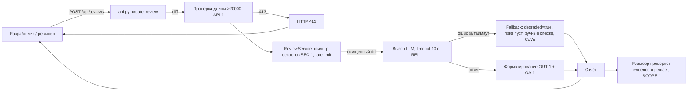

# ADR: решение для первого рабочего сценария
- Статус: accepted
- Дата: 2026-09-20
- Ответственные: команда практик 1–2, практики «AI-помощник ревьюера PR»
- Доработан: 2026-09-20 (Практика 2, шесть техник промптинга — см. «Доработка из Практики 2»)

## Контекст

Сервис ревью PR (`app/review_service.py`, `app/api.py`) принимает diff и возвращает единственное поле `comment` — произвольный текст внешнего LLM. Текущая реализация:

- отправляет diff во внешний LLM без удаления токенов, паролей и ключей (SEC-1 нарушен);
- не проверяет длину diff — огромный diff не отклоняется (API-1 нарушен);
- синхронно вызывает LLM без timeout 10 с и без обработки ошибки (REL-1 нарушен);
- возвращает неструктурированный результат, непригодный для решения человека (OUT-1 нарушен).

Нужен помощник ревьюера, который даёт ревьюеру точные, подтверждённые и проверяемые замечания, сохраняя решение за человеком.

## Решение

Ввести фасад `ReviewService`, публикуемый как локальный прокси-микросервис через `POST /api/reviews` (выбранный вариант интеграции — см. «Вариант интеграции (Tree of Thoughts)»):

1. **API-1:** на входе проверять длину diff; >20 000 символов → HTTP 413.
2. **SEC-1:** перед вызовом LLM фильтровать секреты (токены, пароли, приватные ключи) → `[REDACTED]`; фильтр выполняется на всех ветках, включая fallback (CoVe).
3. **REL-1:** вызывать LLM с timeout 10 с; ошибка/таймаут → контролируемый ответ, а не исключение и HTTP 500.
4. **OUT-1 + QA-1:** приводить ответ LLM к контракту `summary` + `risks` (≤3, с `file`/`line`/`evidence`/`risk`) + `checks`; риск включается только при подтверждении строкой diff или правилом.
5. **SCOPE-1 + OBS-1:** сервис только советует (не approve/merge/edit); в лог пишутся только `request_id`, длительность и статус.
6. **Fallback (CoVe):** при ошибке/таймауте LLM возвращается деградированный, но контролируемый ответ `{degraded: true, summary: из метаданных diff, risks: [], checks: ручные проверки}`; HTTP 500 исключён, fallback не выдаётся за полное ревью.
7. **Rate limit (CoVe/RAG):** при сбое LLM повторные вызовы ограничиваются (N запросов/мин на клиента), при превышении → HTTP 429; бесконечные ретраи запрещены.

Человек остаётся в контуре: ревьюер проверяет каждый риск и принимает решение о merge.

## Вариант интеграции (Tree of Thoughts)

| Вариант | Оценка (1–5) | Вердикт |
|---|---|---|
| A: прямой вызов LLM из CI | 2,4 | Отклонено: блокирует CI, нет централизованного фильтра SEC-1 и rate limit, секреты видны в логах CI |
| B: асинхронный воркер через очередь | 4,0 | Отложено: избыточно для первого сценария; вернёмся при >10 000 ревью/день (см. `tests_load.md`) |
| C: локальный прокси-микросервис (FastAPI `/api/reviews`) | 4,6 | **Выбрано:** один фасад для SEC-1/REL-1/API-1 и Context Pack, синхронный запрос с timeout 10 с, путь роста до B без смены контракта |

Полное сравнение — [`../practice_02/tree_of_thoughts/experiment.md`](../practice_02/tree_of_thoughts/experiment.md).

## Рассмотренные альтернативы

| Альтернатива | Почему не выбрали сейчас |
|---|---|
| Возвращать сырой ответ LLM как сейчас (`{"comment": ...}`) | Нарушает SEC-1/REL-1/OUT-1: нет фильтрации секретов, таймаута и структуры; ответ недоказуем |
| Асинхронная очередь (Celery/очередь задач) для вызова LLM | Усложняет инкремент: для первого сценария достаточно timeout 10 с и контролируемой ошибки; вернёмся при росте нагрузки >10 000 ревью/день (см. `tests_load.md`) |
| Отказаться от LLM, использовать только эвристики/линтеры | Не даёт контекстного анализа связи «нарушение → строка diff»; правила SEC-1…OBS-1 требуют понимания смысла кода |
| Отправлять в LLM весь репозиторий, а не diff | Дорого и избыточно; для ревью одного PR достаточно diff + Context Pack |

## Нефункциональные требования (NFR)

| Категория | Требование | Порог | Как проверяем |
|---|---|---|---|
| Надёжность | Падение или таймаут LLM дают деградированный контролируемый ответ, а не HTTP 500 (REL-1 + Fallback) | 0 запросов с HTTP 500 из-за ошибки LLM; деградированный ответ формируется ≤ 1 с | `tests_integration.md` «мок LLM sleep 15 с → контролируемый ответ»; `tests_unit.md` REL-1 |
| Безопасность | Секреты не покидают сервис и не попадают в лог (SEC-1 + OBS-1) | 0% утечек; в логах только `request_id`, длительность, статус | `tests_unit.md` SEC-1 (token → `[REDACTED]`); проверка логов на отсутствие содержимого diff/ответа |
| Производительность | Ответ сервиса в пределах timeout | p95 ≤ 10 с при timeout 10 с | `tests_load.md` «Штатный поток: 100 RPS, 10 минут» |
| Доступность | Сервис продолжает отвечать при недоступности LLM; повторы ограничены | `/health` = 200 при падении LLM; rate limit → HTTP 429 вместо бесконечных ретраев | `tests_integration.md`; `tests_load.md` «Медленный LLM» |
| Масштабирование | Переход на асинхронный воркер с сохранением контракта API | условие перехода: >10 000 ревью/день | `tests_load.md` (порог начала нагрузочных прогонов) |

Пороги взяты из требований Context Pack и `tests_*.md`; внешние SLA-цифры без источника намеренно не добавлены (RAG).

## Последствия и главный риск

- Положительные последствия: контролируемые вход и выход; секреты не покидают сервис; сбои LLM дают понятную деградированную ошибку без 500; результат можно проверять и включать в решение о merge; наблюдаемость по OBS-1; защита от повторов rate limit'ом.
- Ограничения: максимум 3 риска на ревью; риск только при evidence (QA-1); сервис не меняет код и не работает с GitHub (SCOPE-1); fallback-ответ помечается `degraded=true` и не является полным ревью; небольшие диффы — плоской строкой, а не потоковой передачей.
- Главный риск: LLM сгенерирует риск, который не подтверждается diff или правилом (галлюцинация), и ревьюер сделает ложное замечание.
- Как проверим риск: diff без явных нарушений → ожидаем `risks: []`; каждый риск сверяем со строкой diff или правилом (QA-1); E2E-сценарий из `tests_e2e.md`.

## Архитектурная схема

## Доработка из Практики 2

| Техника | Что добавили в ADR | Эксперимент |
|---|---|---|
| Few-shot | структура по «хорошему» примеру: критерии выбора, trade-offs, NFR | [`../practice_02/few_shot/experiment.md`](../practice_02/few_shot/experiment.md) |
| R.C.T.F. | секция «Нефункциональные требования (NFR)» — роль архитектора безопасности | [`../practice_02/rctf/experiment.md`](../practice_02/rctf/experiment.md) |
| Chain of Verification | fallback `degraded=true` (п.6) и rate limit 429 (п.7) | [`../practice_02/chain_of_verification/experiment.md`](../practice_02/chain_of_verification/experiment.md) |
| Tree of Thoughts | секция «Вариант интеграции»: выбрано C, отложено B | [`../practice_02/tree_of_thoughts/experiment.md`](../practice_02/tree_of_thoughts/experiment.md) |
| RAG | evidence-ссылки на context.md/CASE.md/tests_*.md в NFR и ограничениях | [`../practice_02/rag/experiment.md`](../practice_02/rag/experiment.md) |
| ReAct | аномалия «500 при таймауте» → требования fallback и rate limit | [`../practice_02/react/experiment.md`](../practice_02/react/experiment.md) |

## Как использовали AI

- Для чего: выбрать архитектурное решение (фасад-прокси перед внешним LLM), рассмотреть альтернативы, NFR, fallback и собрать схему процесса
- Тип промпта: zero-shot (P1-01), master prompt (P1-02); Практика 2 — six техник (few-shot, RCTF, CoVe, ToT, RAG, ReAct)
- Строка в [`prompts.md`](prompts.md): P1-01, P1-02; журнал Практики 2: [`../practice_02/prompts.md`](../practice_02/prompts.md)
- Что проверили и исправили сами: каждый элемент схемы и NFR соответствует правилу Context Pack (SEC-1/API-1/REL-1/OUT-1/QA-1/SCOPE-1/OBS-1) и строке diff; убраны альтернативы и SLA-цифры без обоснования; Mermaid-схема и ссылки на эксперименты проверены

